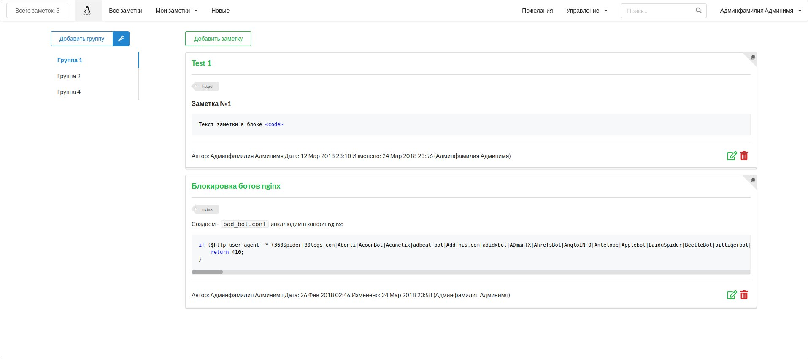
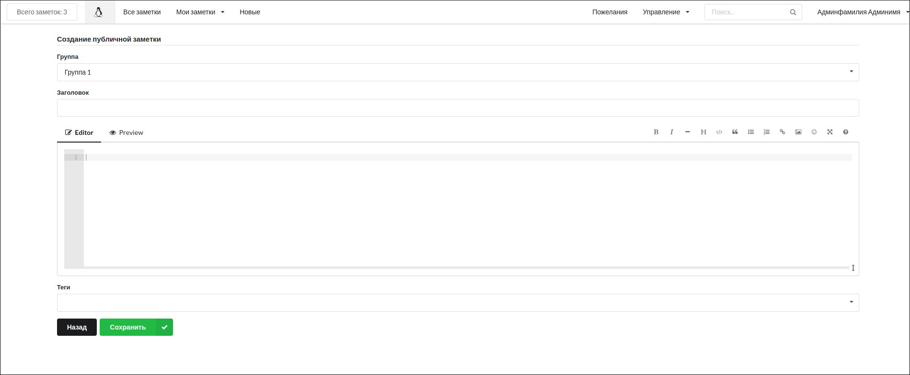

# django-evernote

Приложение для небольших заметок на Django 2 с поддержкой markdown.

> Главная

> Добавление заметки

* Регистрация  отключена, заведение пользователей через админку.
* В приложении организованы теги (двойной клик по тегу запускает поиск).
* Есть раздел с личными заметками (видны только пользователю, который их создал).
* Оповещение модераторам приходит на телеграм через бота (предварительно его нужно создать и добавить токен в файл настроек).
* Можно поделиться заметкой, url строится из имени заметки. К личным заметкам при каждом сохранении добавляется еще небольшая рандом-строка для уникальности.

### Минимальная настройка
* Установить модули python в окружение (python3 -m venv venv; source venv/bin/activate; pip install -r requirements.txt).
* Настроить подключение к БД и запустить миграции (./manage.py makemigrations; ./manage.py migrate; ./manage.py createsuperuser; ./manage.py collectstatic).
* Создать через админку группу "Moderators" и добавить в нее пользователей-модераторов.

> Markdown организован через модуль [Martor](https://github.com/agusmakmun/django-markdown-editor)

> Работа с пользователями через [django-allauth](https://github.com/pennersr/django-allauth)
